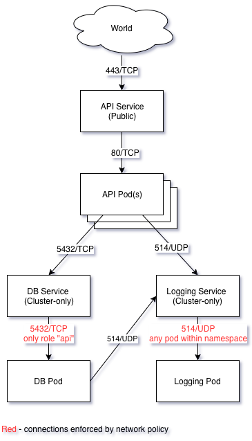

# Inputs
1. Create a Kubernetes cluster
2. Use Weave to setup networking
3. Add three hosts:
* Logger
* API
* DB

4. Use Weave to setup the following network rules:
* API → Logger UDP port 514
* API → DB TCP port 5432
* DB → Logger UDP port 514

5. Visualize this in a network diagram
6. Add a script to prove that each machine can *only* connect to the machine(s) specified in the network rules above  

# Solution
### Cluster setup
* Get source: `git clone https://github.com/max-lobur/k8s-weave-demo.git && cd k8s-weave-demo`
* Get at least 2 CentOS boxes (4 Gb RAM, 2 CPU). Make sure hostnames are unique.  
* Setup master:  
    ```
    ssh root@master 'bash -s' < cluster/k8s-centos.sh
    ssh root@master 'bash -s' < cluster/master.sh
    ```
* Setup node(s):
    ```
    ssh root@node 'bash -s' < cluster/k8s-centos.sh
    ssh root@node <join_cmd_from_master_sh_out>
    ```
* To interact with the cluster we will be using kubectl on the master node, thus source must be copied on master as well: ` rsync -av . root@master:k8s-weave-demo`
* SSH to master:
    ```
    ssh root@master
    cd k8s-weave-demo
    ```
### App setup
* Deploy an app:
    ```
    kubectl create -f app
    watch kubectl -n net-policy-test get po -owide
    ```
* Run tests: `./run-tests.sh`
* Delete an app: `kubectl delete ns net-policy-test`

### Network schema


